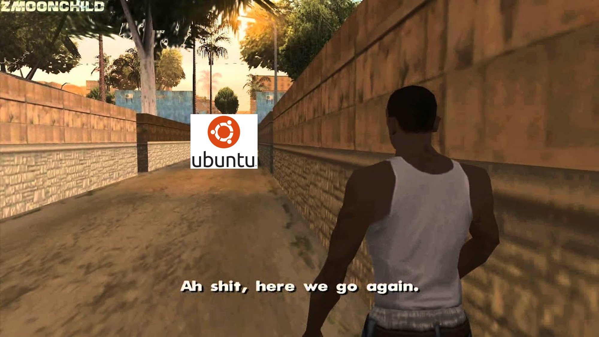
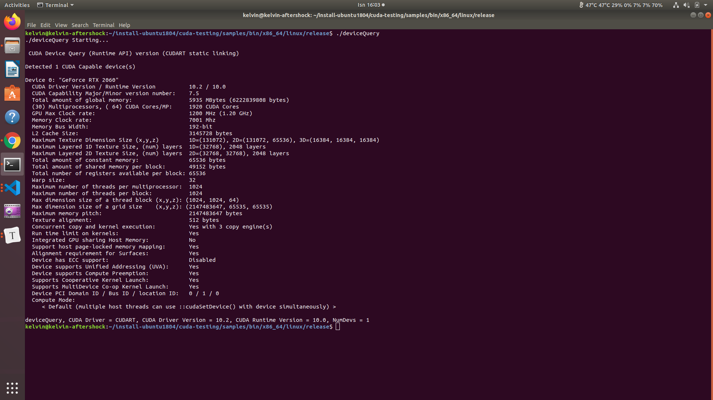
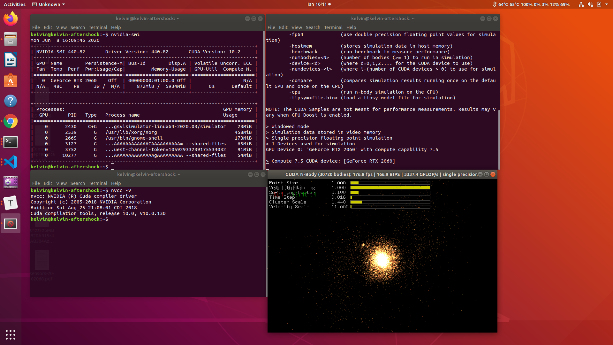

# Reinstalling Ubuntu After It Breaks (Again)



#### Ubuntu likes to break, so here's an script to reinstall packages for your ubuntu for ROS

## Requirements
1. Freshly installed ubuntu 18.04.4 LTS
2. Stable internet connections, you do not want updates to cut halfway
3. A CUDA 10.0 capable GPU, this repo was tested on both GTX1060 and RTX2060

## Instructions
1. Place this repo inside your home directory

2. Download some necessary packages online that apt can't download, and put these under t `utils` folder
   1. [CuDnn for CUDA 10.0](https://docs.nvidia.com/deeplearning/sdk/cudnn-install/index.html)
   2. [Cmake](https://github.com/Kitware/CMake/releases/download/v3.17.3/cmake-3.17.3.tar.gz)
   
3. Do not use your ubuntu for other things while doing the updates, trust me just don't

4. Run the scripts in sequence, and watch for error messages

5. **SPECIAL:** when running the nvidia script, i.e. `install-ubuntu1804-1-nvidia.sh`, go to the terminal only view by going `Ctrl+Alt+3` and run the nvidia script. At the very end of the script it will run a program called ./deviceQuery, if the output shows something like this, you are good. Then continue for reboot

   

6. After reboot, just run these few to check your nvidia driver and CUDA installations, they are the most prone to failure

  ```bash
  nvidia-smi
  nvcc -V
  ~/install-ubuntu1804/cuda-testing/samples/bin/x86_64/linux/release/nbody
  ```
  You should see these kind of outputs. Check the nvidia driver version. And CUDA version (use the nvcc -V terminal, not nvidia-smi)

  

   If you get an error that says that the "Nvidia driver is not loaded", try going in to your system BIOS and disabling secure boot. Secure boot can cause your computer to start without the Nvidia driver.

7. You can run the rest of the installation scripts in normal GUI environment from here on

